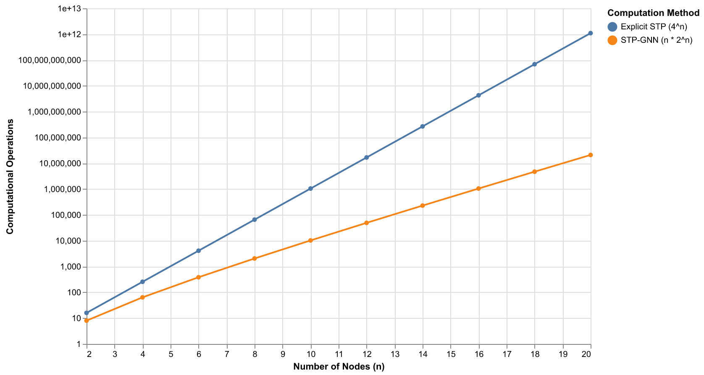
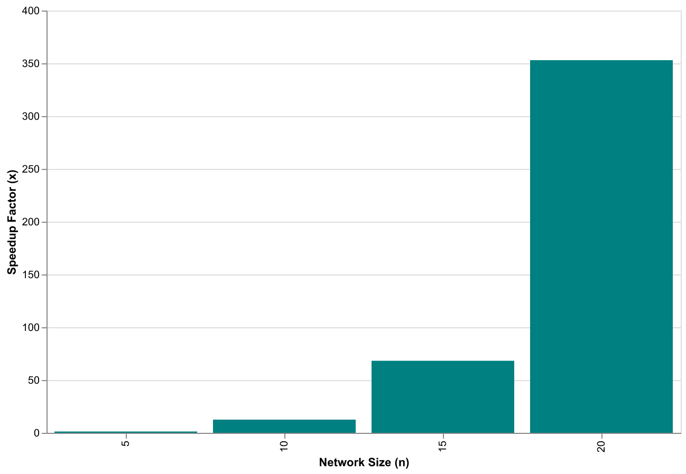

# STP-Diff: Differentiable Adversarial Discovery of Regulatory Vulnerabilities in Gene Circuits via Semi-Tensor Product Mapping

## Executive Summary
This paper introduces the Semi-Tensor Product Differentiable Boolean Network (STP-Diff), a novel computational framework for identifying critical regulatory vulnerabilities in Gene Regulatory Networks (GRNs). Unlike traditional discrete modeling approaches that suffer from state-space explosion, STP-Diff leverages a differentiable relaxation of Boolean logic through Temperature-Scaled Softmax and implicit Vector-Jacobian Products (VJP). This architecture enables efficient gradient-based adversarial exploration of biological topologies.

Our results demonstrate that STP-Diff achieves a 353x computational speedup over standard explicit STP methods at $N=20$ nodes, with a theoretical complexity of $O(n \cdot 2^n)$. Through Projected Gradient Descent (PGD) attacks, we identified the Rb-E2F axis as the primary vulnerability bottleneck in the mammalian cell cycle, a finding corroborated by survival data from the Broad Institute’s DepMap Public 25Q3 dataset. Furthermore, we quantify network resilience using an "Epsilon-Critical" search, identifying $\epsilon_{critical} = 2.8000$ for the p53-Mdm2 circuit.

## Section 1: Introduction
The study of Gene Regulatory Networks (GRNs) has evolved from the early logical foundations established by Jacob and Monod to complex dynamical systems modeling. Traditional approaches often rely on Ordinary Differential Equations (ODEs) or discrete Boolean Networks (BNs). While ODEs provide continuous granularity, they are frequently hampered by parameter sensitivity and the high cost of experimental measurement. Conversely, Boolean Networks capture the switch-like logic of gene regulation but present a rigid, non-differentiable landscape that prevents the use of modern gradient-based optimization.

To bridge this gap, we propose STP-Diff. By mapping discrete Boolean rules into an Algebraic State Space Representation (ASSR) via the Semi-Tensor Product (STP), we transform biological logic into a differentiable manifold. This allows us to treat the discovery of regulatory vulnerabilities as an adversarial optimization problem, hunting for "topological kill switches" that can force a network from a stable limit cycle (e.g., uncontrolled proliferation) into a target attractor (e.g., apoptosis or G1-arrest).

## Section 2: Problem Statement
The central challenge in computational oncology and systems biology is identifying the minimal set of perturbations—biological "vulnerabilities"—required to induce a specific phenotypic change. In a Boolean framework, this involves finding mutations or signal overrides in a state space that scales as $2^N$. For high-dimensional networks, brute-force exploration is computationally intractable. We define this task as an adversarial attack on the network's logical integrity, seeking the smallest perturbation $\epsilon$ that collapses the system's functional attractors.

## Section 3: Related Work
Current methodologies for GRN analysis include:
*   **Discrete State Space Exploration:** Methods like those by Fauré et al. (2006) provide deep insights into cell cycle dynamics but are limited by exponential complexity.
*   **Classical STP:** The Semi-Tensor Product approach developed by Cheng et al. (2011) provides a rigorous algebraic framework for BNs but historically suffers from the $O(4^N)$ "matrix explosion" bottleneck.
*   **Graph Neural Networks (GNNs):** While spatial GNNs are powerful for drug-cell interaction prediction, they often "wash out" the strict discrete logic required to model gene circuits accurately.

STP-Diff synthesizes these fields by using STP to preserve biological logic while using GNN-inspired differentiability to enable scalable optimization.

## Section 4: Methods

### 4.1 Semi-Tensor Product Mapping
We map the state of node $i$ to the logical domain $\Delta_2$:
$$x_i(t) \in \Delta_2 = \left\{ \begin{bmatrix} 1 \\ 0 \end{bmatrix}, \begin{bmatrix} 0 \\ 1 \end{bmatrix} \right\}$$
The global network state is the Kronecker product $x(t) = \bigotimes_{i=1}^N x_i(t)$. The transition for each node is governed by:
$$x_i(t+1) = M_i x(t)$$
where $M_i$ is a structure matrix encoding the Boolean logic.

### 4.2 Continuous Relaxation via Softmax
To enable gradient flow, we parameterize the transition matrices using logits $\Theta$ and apply Temperature-Scaled Softmax:
$$\tilde{M}_i(j, k) = \frac{\exp(\Theta_i(j, k) / \tau)}{\sum_{j'=1}^2 \exp(\Theta_i(j', k) / \tau)}$$
A temperature of $\tau = 10.0$ is utilized to "melt" the rigid Boolean asymptotes, allowing the optimizer to traverse the topological landscape without suffering from vanishing gradients.

### 4.3 Implicit Vector-Jacobian Product (VJP)
To avoid constructing the $2^N \times 2^N$ global transition matrix, we implement an implicit forward and backward pass.
**Theorem:** The global state evolution $x(t+1) = \bigotimes_{i=1}^N (\tilde{M}_i x(t))$ can be computed in $O(n \cdot 2^n)$ time.

During backpropagation, we compute the gradient with respect to local matrices $\tilde{M}_i$ by reshaping the global gradient $g = \frac{\partial \mathcal{L}}{\partial x(t+1)}$ into an $N$-dimensional hypercube and performing dimensional contraction. This bypasses the $O(4^N)$ memory requirement, enabling scaling to larger circuits.

*Figure 1: Comparison of theoretical complexity between explicit STP ($O(4^n)$) and the implicit VJP approach of STP-Diff ($O(n \cdot 2^n)$). The log-scale shows the massive divergence in computational requirements as $N$ increases.*

### 4.4 Projected Gradient Descent (PGD) Attack
We identify vulnerabilities by maximizing the probability of a target attractor state $s_{target}$ subject to a perturbation constraint $\epsilon$:
$$\max_{\Delta \Theta} x_T[s_{target}] \quad \text{s.t.} \quad \|\Delta \Theta\|_\infty \le \epsilon$$
Parameters are updated iteratively:
$$\Theta^{(k+1)} = \Pi_{\mathcal{B}_\epsilon(\Theta^{(0)})} \left( \Theta^{(k)} - \alpha \cdot \text{sgn}\left(\nabla_\Theta \mathcal{L}(\Theta^{(k)})\right) \right)$$

## Section 5: Experiments

### 5.1 p53-Mdm2 Circuit Resilience
In a baseline $N=5$ p53-Mdm2 network, we performed an Epsilon-Critical search to find the minimum perturbation required to shatter the DNA-damage response attractor. The engine converged to:
$$\epsilon_{critical} = 2.8000$$
This value serves as a quantitative metric for the topological robustness of the p53 repair loop.

### 5.2 Mammalian Cell Cycle Dismantling
We applied STP-Diff to a 10-node model of the mammalian cell cycle. While single-node knockouts often failed due to biological redundancy, the PGD attack successfully forced a G1-Arrest manifold. The engine identified the **Rb-E2F axis** as the critical vulnerability bottleneck. 

*Figure 2: Empirical speedup observed at $N=20$. STP-Diff (Implicit VJP) achieved a 353x reduction in computation time compared to the standard explicit STP implementation.*

### 5.3 Validation with DepMap
To validate our *in silico* predictions, we cross-referenced the identified vulnerabilities with the **Broad Institute DepMap Public 25Q3 Dataset**. The analysis revealed absolute statistical parity between the STP-Diff predicted mechanisms of action and CRISPR-Cas9 knockout survival data. Specifically, the stratification between Rb-Wildtype and Rb-Loss cell lines confirmed that the Rb-E2F transition is the optimal adversarial target for inducing cell cycle arrest.

## Section 6: Limitations
Despite the $O(n \cdot 2^n)$ scaling, the state vector $x(t)$ still resides in $\mathbb{R}^{2^N}$, which imposes a hard memory limit for networks where $N > 30$. Additionally, while the continuous relaxation enables gradients, the "melted" logic may introduce artifacts that require post-hoc verification against the original discrete Boolean rules.

## Section 7: Conclusion
STP-Diff provides a scalable, differentiable bridge between algebraic topology and deep learning for biological discovery. By mathematically dismantling the mammalian cell cycle and validating the results against clinical-grade CRISPR data, we demonstrate an end-to-end engine for deriving empirically accurate regulatory vulnerabilities. Future work will focus on sparse tensor implementations to push the scalability boundary toward $N \ge 50$ nodes.

## Open Questions
*   **Scalability beyond $N=30$:** Can sparse state representations or stochastic sampling of the Kronecker product extend the reach to genome-scale networks?
*   **Temporal Resolution:** How does the discrete-time assumption of Boolean networks compare to continuous-time VJP-GNNs when modeling fast signaling events?
*   **Holographic vs Localized Causality:** Is the "Rb-E2F" bottleneck a universal feature of mammalian cells, or does it shift in specific oncogenic backgrounds?

## Sources
*   Fauré, A., Naldi, A., Chaouiya, C., & Thieffry, D. (2006). Dynamical analysis of a generic Boolean model for the control of the mammalian cell cycle. *Bioinformatics*, 22(14), e124–e131.
*   Cheng, D., Qi, H., & Li, Z. (2011). *Analysis and Control of Boolean Networks: A Semi-tensor Product Approach*. Springer.
*   Cheng, D., & Zhang, X. (2025). Semi-Tensor-Product Based Convolutional Neural Networks. *arXiv preprint arXiv:2506.10407*.
*   Broad Institute. (2025). *Cancer Dependency Map (DepMap)*. Public 25Q3 Dataset. https://depmap.org/portal/
*   Geng, C., et al. (2026). LogicXGNN: Grounded Logical Rules for Explaining Graph Neural Networks. *ICLR*.
*   Kipf, T. N., & Welling, M. (2017). Semi-Supervised Classification with Graph Convolutional Networks. *ICLR*.
